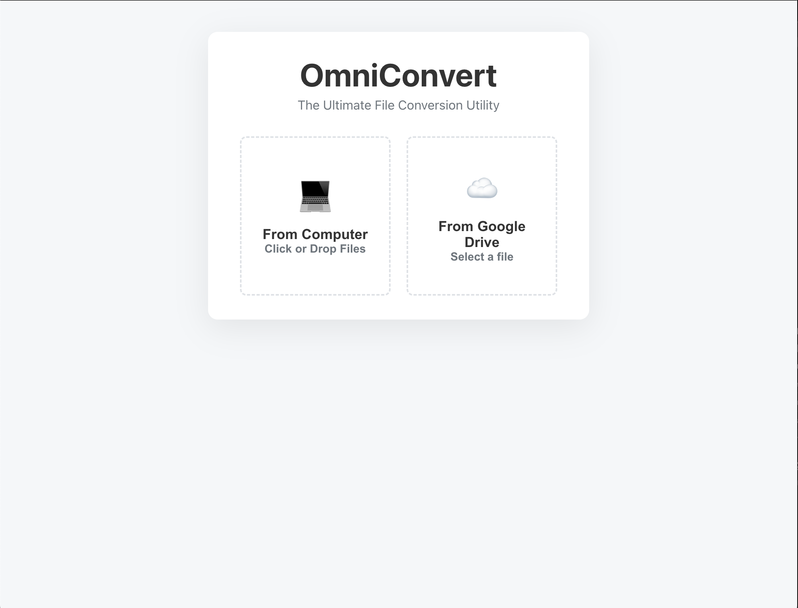

# ⚡ OmniConvert
> The Ultimate, Privacy-Focused File Conversion Utility for macOS.

 
*(Note: Take a screenshot of your app with a file converting and replace the link above)*

## 📖 Overview
OmniConvert is a native desktop application that replaces ad-riddled online converters. It processes files locally using powerful open-source engines, ensuring 100% privacy and zero file-size limits. It supports **100+ formats** across Audio, Video, Images, Documents, eBooks, and 3D Models.

## ✨ Key Features
*   **Universal Conversion:** Handles everything from `.CR2` RAW photos to `.MKV` 4K video.
*   **Cloud Integration:** Seamlessly connect **Google Drive** to browse, search, and convert cloud files directly.
*   **Smart Automation:** 
    *   Auto-detects file types and offers relevant conversions.
    *   Automatically zips multiple outputs or downloads single files directly.
*   **Privacy First:** All conversions happen on your machine or in a secure temporary stream. No data is harvested.
*   **Native Experience:** Drag-and-drop interface, real-time progress bars, and native file dialogs.

## 🛠 Tech Stack
*   **Frontend:** React, CSS3 (Custom Glassmorphism UI)
*   **Backend:** Node.js, Express, WebSockets (`ws`)
*   **Desktop Wrapper:** Electron (IPC Main/Renderer)
*   **Engines:** FFmpeg, ImageMagick, LibreOffice (Headless), Pandoc, Calibre, Assimp, Unar.

## 💡 Technical Challenges & Solutions
*(This is the most important section for your portfolio)*

### 1. The "Stale Session" Concurrency Bug
**Problem:** Integrating Google OAuth in a desktop environment caused race conditions where the WebSocket connection would hold onto an old, unauthenticated session state after a login popup closed.
**Solution:** Architected a **Stateless Token Store**. Instead of relying on `express-session` cookies, the auth window passes a unique cryptographic token ID back to the main process via `postMessage`. The WebSocket then requests fresh credentials using this ID on every transaction, eliminating race conditions.

### 2. Handling Read-Only File Systems (Electron)
**Problem:** The app crashed in production because it attempted to write temporary files inside the `.app` bundle, which is read-only on macOS.
**Solution:** Implemented dynamic path resolution using `app.getPath('userData')` to route all I/O operations to the system's safe Application Support directory, with automated cleanup on startup.

### 3. Native Binary Orchestration
**Problem:** Different file types require different CLI tools, each with unique flags and quirks (e.g., LibreOffice failing on HTML, or FFmpeg failing on M4A containers).
**Solution:** Built a **Smart Routing Engine** in Node.js. It analyzes file signatures and routes tasks to the specific engine (piping `dcraw` output to `ImageMagick` for RAW photos, or forcing `aac` codecs for audio) to ensure 100% reliability.

## 🚀 How to Run Locally
1.  **Prerequisites:** Install `ffmpeg`, `imagemagick`, `unar`, `calibre`, `assimp` via Homebrew.
2.  **Clone:** `git clone https://github.com/yourusername/OmniConvert.git`
3.  **Install:** `npm install` in root, client, and server folders.
4.  **Run:** `npm start`

---
*Built by [Sijune Kim - age 13]*