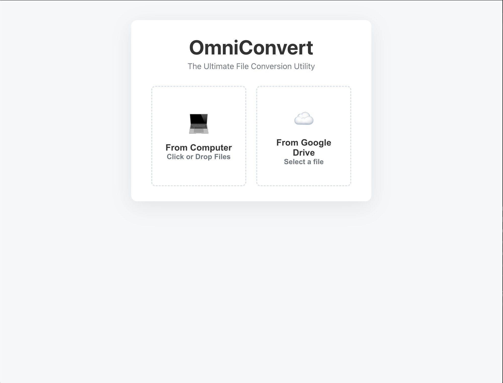

# ⚡ OmniConvert
> The Ultimate, Privacy-Focused File Conversion Utility for macOS.

*(Note: Replace `assets/omniconvert.png` with a real screenshot of your app)*

## 📖 Overview
OmniConvert is a native desktop application that replaces ad-riddled online converters. It processes files locally using powerful open-source engines, ensuring 100% privacy and zero file-size limits. It supports **100+ formats** across Audio, Video, Images, Documents, eBooks, and 3D Models.

## ✨ Key Features
* **Universal Conversion:** Handles everything from `.CR2` RAW photos to `.MKV` 4K video.
* **Cloud Integration:** Seamlessly connect **Google Drive** to browse, search, and convert cloud files directly.
* **Smart Automation:**
  * Auto-detects file types and offers relevant conversions.
  * Automatically zips multiple outputs or downloads single files directly.
* **Privacy First:** All conversions happen on your machine or in a secure temporary stream. No data is harvested.
* **Native Experience:** Drag-and-drop interface, real-time progress bars, and native file dialogs.

## 🛠 Tech Stack
* **Frontend:** React, CSS3 (Custom Glassmorphism UI)
* **Backend:** Node.js, Express, WebSockets (`ws`)
* **Desktop Wrapper:** Electron (IPC Main/Renderer)
* **Engines:** FFmpeg, ImageMagick, LibreOffice (Headless), Pandoc, Calibre, Assimp, Unar.

## 💡 Technical Challenges & Solutions

### 1. The "Stale Session" Concurrency Bug
**Problem:** Integrating Google OAuth in a desktop environment caused race conditions where the WebSocket connection would hold onto an old, unauthenticated session state after a login popup closed.

**Solution:** Architected a **Stateless Token Store**. Instead of relying on `express-session` cookies, the auth window passes a unique cryptographic token ID back to the main process via `postMessage`. The WebSocket then requests fresh credentials using this ID on every transaction, eliminating race conditions.

### 2. Handling Read-Only File Systems (Electron)
**Problem:** The app crashed in production because it attempted to write temporary files inside the `.app` bundle, which is read-only on macOS.

**Solution:** Implemented dynamic path resolution using `app.getPath('userData')` to route all I/O operations to the system's safe Application Support directory, with automated cleanup on startup.

### 3. Native Binary Orchestration
**Problem:** Different file types require different CLI tools, each with unique flags and quirks (e.g., LibreOffice failing on HTML, or FFmpeg failing on M4A containers).

**Solution:** Built a **Smart Routing Engine** in Node.js. It analyzes file signatures and routes tasks to the specific engine (piping `dcraw` output to `ImageMagick` for RAW photos, or forcing `aac` codecs for audio) to ensure 100% reliability.

## 🔑 Configuration (Important)
To use the Google Drive features, you must configure the backend credentials:

1. Locate the `.env.example` file in the **Root** folder.
2. Duplicate it and rename the copy to `.env`.
3. Open `.env` and paste your own **Google Client ID** and **Client Secret**.
*(If you don't have these, the app will still run, but Cloud features will fail).*

## 🚀 How to Run Locally

### 1. Prerequisites
Install the required system tools via Homebrew:

    brew install ffmpeg imagemagick unar calibre assimp
 ### 2. Installation
You must install dependencies for both the root application and the React client.

    # Clone the repo
    git clone https://github.com/sijunekim/Omniconvert.git
    cd Omniconvert

    # Install Root/Electron dependencies
    npm install

    # Install Client/React dependencies
    cd client
    npm install

### 3. Running the App

You need to run the React Frontend and the Electron app in two separate terminals.

Terminal 1 (Start Frontend):
    cd client
    npm start

Wait until you see "Compiled successfully" or "Local: http://localhost:3000".

Terminal 2 (Start Electron):
Leave Terminal 1 running. Open a new terminal in the root folder and run:
    npm start

Built by Sijune Kim (age 13)